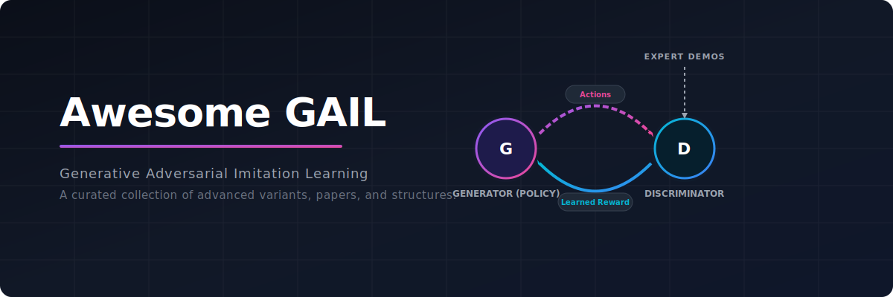

  

  <h1>🤖 Awesome Generative Adversarial Imitation Learning (GAIL)</h1>
  
A curated directory of state-of-the-art Generative Adversarial Imitation Learning (GAIL) variants, optimization frameworks, safety layers, and applications.

  
  
  
  
  

---

## 📌 Overview

**Generative Adversarial Imitation Learning (GAIL)** bypasses traditional Inverse Reinforcement Learning (IRL) by directly extracting a policy from expert demonstrations. Inspired by Generative Adversarial Networks (GANs), it employs a two-player game:
* **The Generator (Policy):** Mimics the expert behaviors in the environment.
* **The Discriminator:** Learns to distinguish between the actions of the expert and the agent, generating an adversarial reward.

This repository catalogs key adaptations of GAIL designed to address issues in sample efficiency, observation constraints, multi-agent dynamics, safety boundaries, and robustness.

---

## 🗺️ Table of Contents

1. [Standard GAIL (Base GAIL)](#1-standard-gail-base-gail)
2. [Sample-Efficiency & Stability Variants](#2-sample-efficiency--stability-variants)
3. [Partially Observable & Multi-Agent Adaptations](#3-partially-observable--multi-agent-adaptations)
4. [Safety & Robustness Variants](#4-safety--robustness-variants)

---

## 1. ⚙️ Standard GAIL (Base GAIL)

* **Definition:** The foundational framework introduced by Ho and Ermon (2016).
* **Mechanism:** Employs a model-free adversarial setup using a surrogate reward function derived from the discriminator's output.
* **Optimization:** Typically uses Trust Region Policy Optimization (TRPO) or Proximal Policy Optimization (PPO) to update the agent's policy.
* **Core Benefit:** Allows agents to learn complex, continuous control tasks directly from raw expert trajectories without manually designing reward functions.

---

## 2. ⚡ Sample-Efficiency & Stability Variants

Standard GAIL suffers from high sample complexity and training instability. These variants optimize data usage and reward signals:

| Variant | Year | Paper Link | Description |
| :--- | :---: | :--- | :--- |
| [**SAM-GAIL**](docs/sam-gail.md) | 2019 | [arXiv:1809.02064](https://arxiv.org/abs/1809.02064) | Integrates off-policy RL (like SAC or TD3) to reuse past transition data, reducing environment interactions. |
| [**InfoGAIL**](docs/infogail.md) | 2017 | [arXiv:1703.08840](https://arxiv.org/abs/1703.08840) | Uses Information Maximization to learn interpretable, latent sub-skills from heterogeneous demonstrations. |
| [**DAC**](docs/dac.md) | 2018 | [arXiv:1809.02925](https://arxiv.org/abs/1809.02925) | Addresses "surrogate reward bias" by treating the discriminator as a dynamic reward function in an actor-critic framework. |

---

## 3. 🔍 Partially Observable & Multi-Agent Adaptations

These adaptations extend GAIL to handle complex environment structures and multiple interacting players:

| Variant | Year | Paper Link | Description |
| :--- | :---: | :--- | :--- |
| [**PO-GAIL**](docs/po-gail.md) | 2020 | [arXiv:2011.04642](https://arxiv.org/abs/2011.04642) | Modifies the discriminator to handle partially observable environments using historical observation sequences. |
| [**MAGAIL**](docs/magail.md) | 2018 | [arXiv:1807.09936](https://arxiv.org/abs/1807.09936) | Extends GAIL to multi-agent environments, training decentralized policies from coordinate demonstrations. |
| [**Third-Person GAIL**](docs/third-person-gail.md) | 2017 | [arXiv:1703.01703](https://arxiv.org/abs/1703.01703) | Corrects for domain shifts, allowing learning from expert demonstrations recorded from different perspectives. |

---

## 4. 🛡️ Safety & Robustness Variants

Safety-critical applications require agents to explore safely and remain robust to corrupted observations or suboptimal demonstrations:

| Variant | Year | Paper Link | Description |
| :--- | :---: | :--- | :--- |
| [**Safe-GAIL**](docs/safe-gail.md) | 2020 | [Link](https://www.researchgate.net/publication/341545454_Safe_Generative_Adversarial_Imitation_Learning) | Constrains policy generation using Cost Functions or Control Barrier Functions to ensure safety during exploration. |
| [**Robust GAIL**](docs/robust-gail.md) | 2019 | [arXiv:1905.04418](https://arxiv.org/abs/1905.04418) | Models bounded noise or expert sub-optimality to prevent mimicking bad habits and ensure robustness. |
