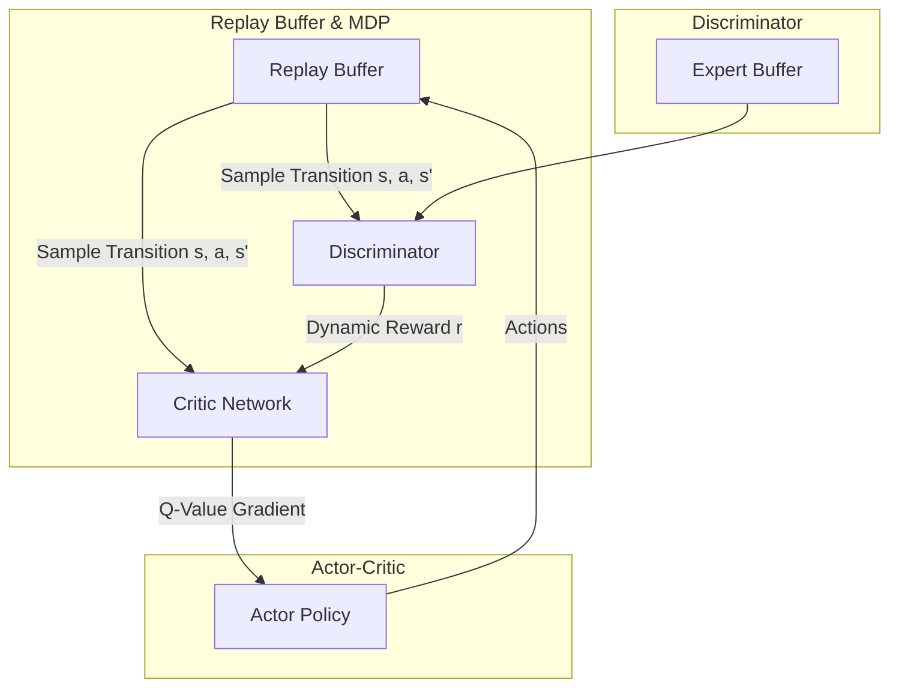

# DAC: Discriminator-Actor-Critic

**Discriminator-Actor-Critic (DAC)** is a sample-efficient adversarial imitation learning framework. It overcomes two major bottlenecks of standard GAIL: the sample inefficiency of on-policy reinforcement learning and the reward bias that occurs due to incorrect handling of absorbing states in environments.

---

## 1. The Core Problems
Standard GAIL implementations suffer from two main issues:
1. **Absorbing State Bias:** Reinforcement learning environments often end with terminal/absorbing states (e.g. falling over in locomotion). If the discriminator is not trained to handle these absorbing states explicitly, it can create a bias in the reward function (e.g. encouraging the agent to fall over early to avoid negative rewards, or survive forever regardless of task success).
2. **Sample Inefficiency:** Like SAM-GAIL, standard GAIL relies on on-policy algorithms, meaning environment data is used once and thrown away.

---

## 2. DAC Mechanism
DAC solves these issues through a dual approach:
1. **Absorbing State Extension:** Explicitly wraps the environment state representation to include absorbing state indicator variables, allowing the discriminator to learn unbiased rewards at the boundary of episode termination.
2. **Off-Policy Actor-Critic:** Combines the discriminator with an off-policy actor-critic reinforcement learning algorithm (such as TD3 or SAC). Actor, critic, and discriminator are trained asynchronously, leveraging a shared Replay Buffer.

---

## 3. Architecture Diagram

---

## 4. Key Advantages
* **Task-Independent Unbiased Rewards:** Properly recovers the underlying expert rewards without human intervention or environment-specific rewards shaping.
* **10x Sample Efficiency:** Achieves similar or better performance compared to GAIL and AIRL with up to an order of magnitude fewer environment steps.
* **Stable Training:** The off-policy critic stabilizes the policy gradient estimation.

---

## 5. Paper Reference
* **Paper Title:** *Discriminator-Actor-Critic: Addressing Sample Inefficiency and Reward Bias in Adversarial Imitation Learning*
* **Publication:** ICML 2018
* **Paper Link:** [arXiv:1809.02925](https://arxiv.org/abs/1809.02925)

---

[← Back to README](../README.md)
