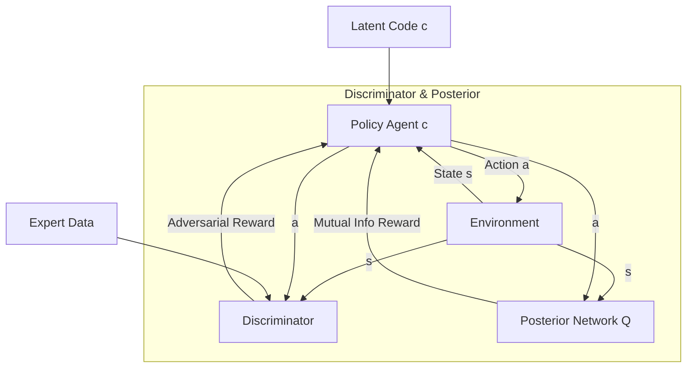

# InfoGAIL: Interpretable Generative Adversarial Imitation Learning

Standard GAIL assumes that all expert demonstrations come from a single, unimodal policy, which prevents it from extracting distinct styles or sub-skills. **InfoGAIL** extends the framework by introducing latent variables, forcing the agent to disentangle and learn interpretable behaviors from heterogeneous datasets.

---

## 1. The Core Problem
Expert demonstrations are often multi-modal. For example:
* In driving, one expert may drive defensively while another drives aggressively.
* In robotics, there are multiple trajectories to grasp or move an object.
Vanilla GAIL attempts to average these behaviors, leading to suboptimal policies (e.g. driving right down the middle of two lanes) and offers no way for a user to specify *how* the agent should perform a task.

---

## 2. InfoGAIL Mechanism
InfoGAIL addresses this using information-theoretic concepts:
1. **Latent Code ($c$):** The policy is conditioned on both the state $s$ and a latent code $c$: $\pi(a|s, c)$.
2. **Mutual Information Maximization:** The optimization objective includes a term to maximize the mutual information $I(c; (s, a))$ between the latent code and the generated trajectories.
3. **Posterior Approximation Network ($Q$):** A network $Q(c|s, a)$ is trained to predict the latent code $c$ that generated the state-action pair $(s, a)$. The policy receives an extra reward for generating state-action pairs from which $Q$ can easily reconstruct the original latent code $c$.

---

## 3. Architecture Diagram

---

## 4. Key Advantages
* **Interpretable Behaviors:** Changing the latent code $c$ at test time allows users to select specific behavioral profiles (e.g., fast vs. slow speed, left lane vs. right lane).
* **Multi-Modal Learning:** Avoids "averaging" out contradictory demonstrations.
* **Unsupervised Disentanglement:** Discovers underlying sub-skills without explicit labels.

---

## 5. Paper Reference
* **Paper Title:** *InfoGAIL: Interpretable Imitation Learning from Visual Demonstrations*
* **Publication:** NIPS 2017
* **Paper Link:** [arXiv:1703.08840](https://arxiv.org/abs/1703.08840)

---

[← Back to README](../README.md)
