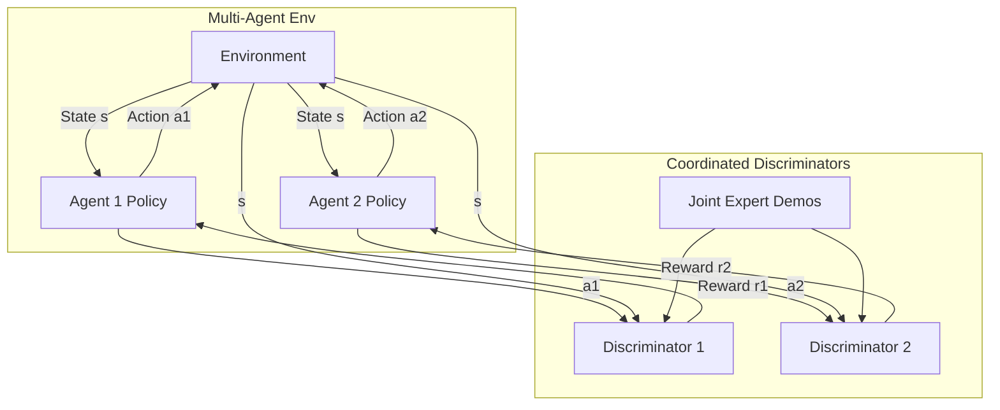

# MAGAIL: Multi-Agent Generative Adversarial Imitation Learning

Imitating behaviors in multi-agent environments is highly challenging due to non-stationarity (each agent's environment changes as other agents learn) and coordination requirements. **MAGAIL** generalizes the GAIL framework to general Markov games, enabling decentralized agents to learn coordinated policies from joint demonstrations.

---

## 1. The Core Problem
When applying single-agent GAIL directly to multi-agent settings (e.g. multi-car driving or cooperative robotics):
* **Non-Stationarity:** An agent's environment changes because other agents are updating their policies simultaneously.
* **Coordination Collapse:** If agents are treated independently, they fail to learn interactions (e.g. passing a ball, avoiding collisions) because the discriminator cannot evaluate joint distributions.

---

## 2. MAGAIL Mechanism
MAGAIL models the multi-agent imitation problem as a Markov game:
1. **Joint or Decentralized Discriminators:** Depending on the cooperative or competitive nature of the task, discriminators evaluate joint states and actions: $D_i(s, a_1, a_2, ..., a_N)$. This provides coordination-sensitive rewards.
2. **Decentralized Policies:** Each agent maintains its own policy $\pi_i(a_i | s)$, allowing execution without global communication.
3. **Multi-Agent Reinforcement Learning (MARL):** Agents update their policies using algorithms adapted for Markov games (such as MADDPG or MAPPO), optimizing their actions against the rewards output by the coordinated discriminators.

---

## 3. Architecture Diagram

---

## 4. Key Advantages
* **Emergent Coordination:** Successfully reproduces complex team interactions (e.g., flocking, defensive positioning).
* **Scalable Execution:** While training can be centralized, the resulting policies are fully decentralized.
* **Cooperative & Competitive Flexibility:** Can adapt to zero-sum games, general-sum games, and fully cooperative environments.

---

## 5. Paper Reference
* **Paper Title:** *Multi-Agent Generative Adversarial Imitation Learning*
* **Publication:** NeurIPS 2018
* **Paper Link:** [arXiv:1807.09936](https://arxiv.org/abs/1807.09936)

---

[← Back to README](../README.md)
