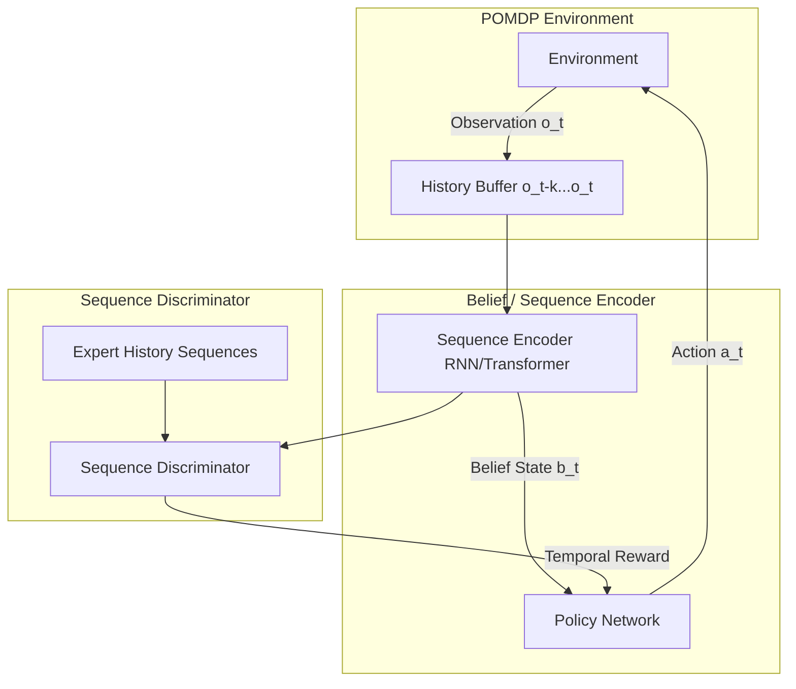

# PO-GAIL: Partially Observable Generative Adversarial Imitation Learning

Standard GAIL operates under the assumption of a fully observable Markov Decision Process (MDP). In real-world applications, however, agents usually receive partial observations (POMDPs). **PO-GAIL** extends the GAIL framework to handle missing state information, sensor noise, and temporal dependencies.

---

## 1. The Core Problem
In partially observable environments, a single observation $o_t$ does not contain enough information to reconstruct the true state $s_t$.
* **Ambiguous States:** Multiple states can yield the same observation, leading standard policies to make incorrect decisions.
* **Discriminator Failure:** If the discriminator only receives $(o_t, a_t)$ pairs, it cannot correctly assess the expert's behavior, leading to poor reward signals.

---

## 2. PO-GAIL Mechanism
PO-GAIL resolves the partial observability issue by utilizing temporal context:
1. **History Processing:** Instead of using single observations, the policy $\pi(a_t | h_t)$ and discriminator $D(h_t, a_t)$ operate on observation-action histories $h_t = (o_{t-k}, a_{t-k}, ..., o_t)$.
2. **Belief / Sequence Encoders:** Uses Recurrent Neural Networks (LSTMs/GRUs) or Transformers to compile historical inputs into a compact representation or belief state $b_t$.
3. **Temporal Discriminator:** The discriminator distinguishes between expert history sequences and agent history sequences, ensuring the agent matches the trajectory distributions over time, not just instantaneous observation points.

---

## 3. Architecture Diagram

---

## 4. Key Advantages
* **Sensor-Agnostic Imitation:** Can learn from sensors with occlusions, noise, or delay (e.g. camera feeds without depth data).
* **Markovian Trajectories:** Sequence modeling recovers the Markov property over history, allowing standard RL policy updates.
* **Temporal Consistency:** Prevents high-frequency policy oscillation under noisy observations.

---

## 5. Paper Reference
* **Paper Title:** *Partially Observable Generative Adversarial Imitation Learning*
* **Publication:** 2020
* **Paper Link:** [arXiv:2011.04642](https://arxiv.org/abs/2011.04642)

---

[← Back to README](../README.md)
