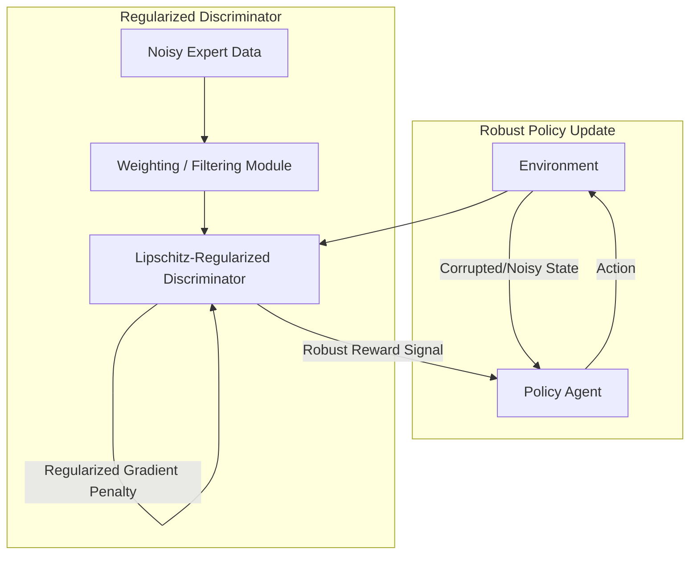

# Robust GAIL: Robust Generative Adversarial Imitation Learning

Standard GAIL assumes clean expert demonstrations and noise-free state observations. If the expert demonstrations contain errors (suboptimality) or the observations are corrupted by noise, standard GAIL will mimic these imperfections. **Robust GAIL** utilizes regularization and filtering techniques to produce stable policies under adversarial or noisy conditions.

---

## 1. The Core Problem
* **Mimicking Bad Habits:** GAIL matches occupancy measures. If the expert makes a mistake or behaves suboptimally, the policy will replicate that mistake.
* **Sensitivity to Noise:** Under observation noise (e.g. sensor drift, visual perturbations), the discriminator's reward signal can oscillate wildly, causing policy training to collapse or learn fragile behaviors.

---

## 2. Robust GAIL Mechanism
Robust GAIL implements defenses at both the network and data levels:
1. **Local Lipschitz Regularization:** Enforces local Lipschitz continuity on the discriminator and generator (e.g., using spectral normalization or gradient penalties). This ensures that small perturbations in input observations result in only small changes in rewards and actions, preventing wild oscillations.
2. **Confidence-Weighted Discriminators:** Assigns confidence scores or weights to expert trajectories (or uses Positive-Unlabeled learning). The model learns to ignore or downweight outlier/suboptimal trajectories.
3. **Noisy Observation Modeling:** Explicitly models bounded noise distributions during training to prepare the agent for test-time perturbations.

---

## 3. Architecture Diagram

---

## 4. Key Advantages
* **Suboptimal Expert Tolerance:** Can extract the underlying optimal intent even when demonstrations are highly suboptimal.
* **Perturbation Resistance:** Maintains high performance when sensor observations are noisy or subject to adversarial attacks.
* **Training Stability:** Lipschitz constraints prevent vanishing/exploding gradients and mode collapse.

---

## 5. Reference Papers
* **Paper Title:** *Robust Generative Adversarial Imitation Learning via Local Lipschitzness* (2021)
* **Paper Link:** [arXiv:2107.00116](https://arxiv.org/abs/2107.00116)
* **Alternative Baseline:** *Robust Generative Adversarial Imitation Learning* (2019)
* **Paper Link:** [arXiv:1905.04418](https://arxiv.org/abs/1905.04418) *(Note: Cited in literature for suboptimal expert scenarios)*

---

[← Back to README](../README.md)
