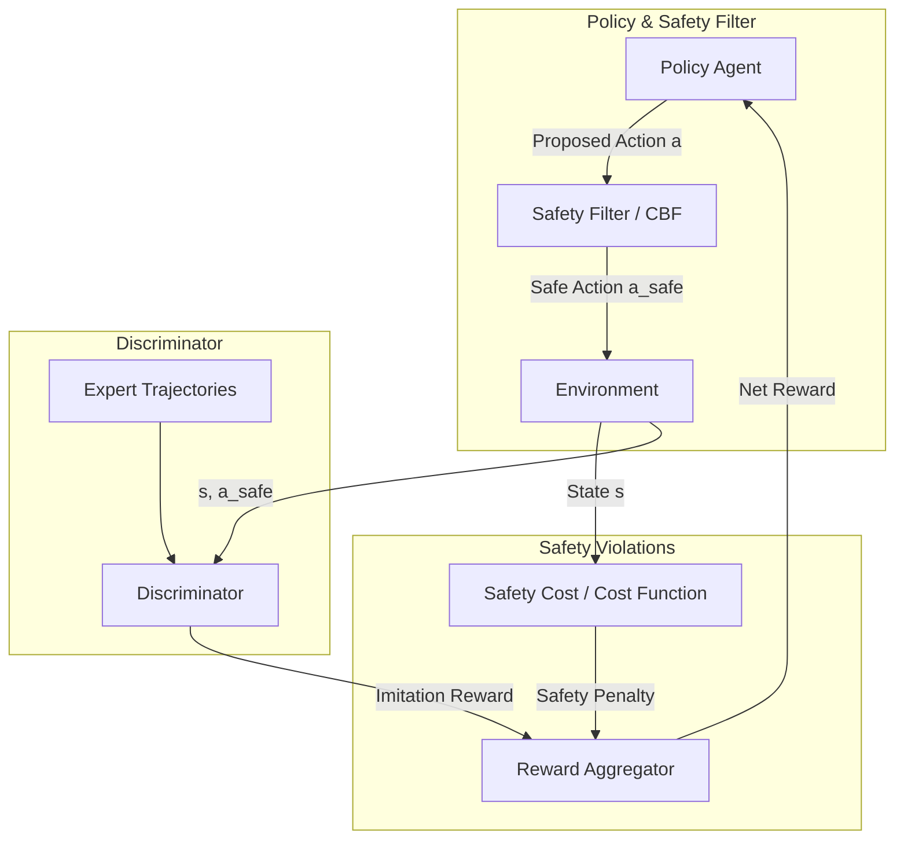

# Safe-GAIL: Safe Generative Adversarial Imitation Learning

Adversarial exploration in standard GAIL is unconstrained. When applied to physical platforms (e.g. autonomous vehicles or industrial robots), the agent's initial trial-and-error behaviors can damage hardware or violate critical safety boundaries. **Safe-GAIL** incorporates safety constraints directly into the adversarial training loop.

---

## 1. The Core Problem
* **Unsafe Exploration:** The discriminator's reward signal is learned dynamically. Early in training, the agent operates under highly random or inaccurate reward estimations, leading it to take hazardous actions.
* **Lack of Hard Guarantees:** Standard neural network policies cannot guarantee that they will never violate safety thresholds (e.g. hitting a wall or exceeding velocity limits) during training or deployment.

---

## 2. Safe-GAIL Mechanism
Safe-GAIL introduces safety boundaries using mathematical controls and constrained optimization:
1. **Control Barrier Functions (CBFs) / Safety Filters:** Actions proposed by the generator ($\pi(a|s)$) pass through an analytical safety filter before executing in the environment. If the action is determined to lead to an unsafe state, the filter overrides it with a safe corrective action.
2. **Lagrangian Constraint Optimization:** Incorporates a separate cost function $C(s, a)$ that tracks safety violations. The training objective is formulated as a constrained Markov Decision Process (CMDP), optimized via Lagrange multipliers to maximize imitation while keeping safety costs below a threshold.
3. **Safety-Critic:** Learns to estimate the long-term safety cost of actions, helping the agent proactively avoid regions of the state space associated with high risks.

---

## 3. Architecture Diagram

---

## 4. Key Advantages
* **Zero-Violation Training:** Keeps the agent safe during the active learning phase, protecting physical machinery.
* **Expert Suboptimality Resilience:** Can learn a safe policy even if the expert demonstrations contain occasional unsafe actions.
* **Hard Constraints:** Enforces physical boundaries (e.g., maximum torque, collision zones) rather than just soft penalties.

---

## 5. Reference
* **Paper Title:** *Safe Generative Adversarial Imitation Learning*
* **Publication:** 2020
* **Paper Link:** [ResearchGate Link](https://www.researchgate.net/publication/341545454_Safe_Generative_Adversarial_Imitation_Learning)

---

[← Back to README](../README.md)
