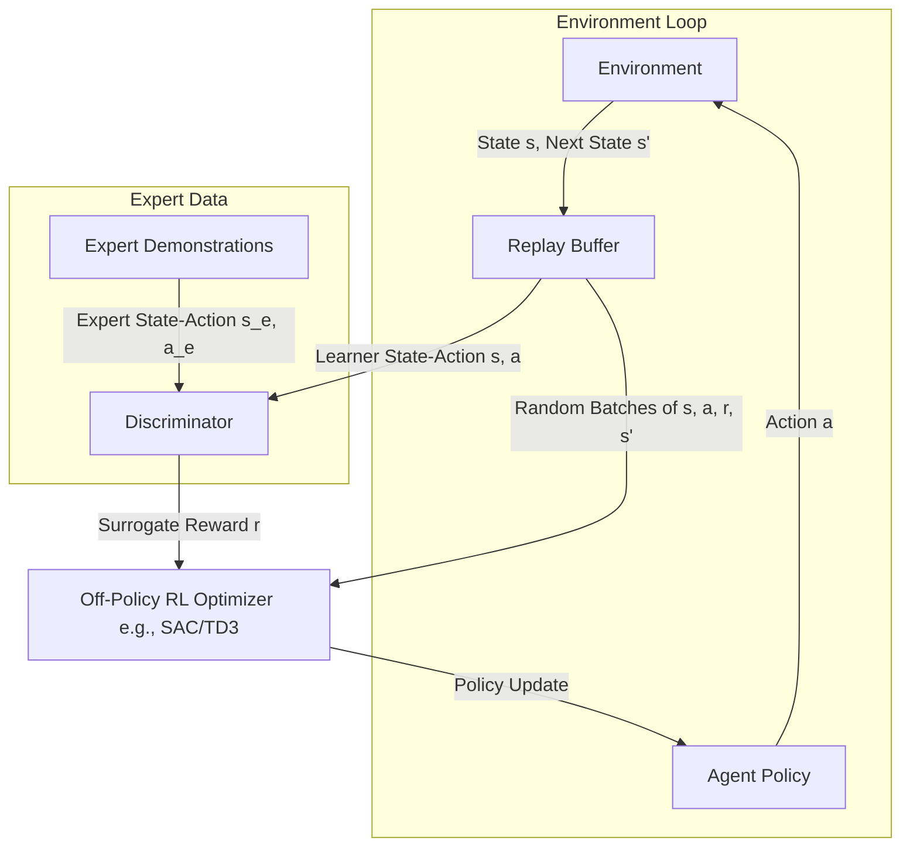

# SAM-GAIL: Sample-Efficient Adversarial Imitation Learning

Generative Adversarial Imitation Learning (GAIL) is inherently sample-inefficient. Because standard GAIL is on-policy, it requires collecting a massive volume of new transitions from the environment at every training step. **SAM-GAIL (Sample-efficient Adversarial Mimic)** addresses this bottleneck by integrating off-policy reinforcement learning with adversarial imitation.

---

## 1. The Core Problem
Standard GAIL typically employs on-policy policy gradient algorithms (like TRPO or PPO) to optimize the generator (policy). This results in:
* **High Sample Complexity:** The agent must discard collected transitions after a single policy update.
* **Prohibitive Environment Interaction:** Running physical robots or complex simulators becomes extremely expensive and slow.

---

## 2. SAM-GAIL Mechanism
SAM-GAIL solves this by reformulating the reinforcement learning step as an off-policy optimization problem:
1. **Replay Buffer:** Stores all agent-environment interactions $(s, a, r, s')$, allowing data to be reused across multiple updates.
2. **Off-Policy RL Core:** Utilizes algorithms like Soft Actor-Critic (SAC) or Deep Deterministic Policy Gradient (DDPG / TD3).
3. **Adversarial Reward:** The discriminator $D$ computes the step reward $r = -\log(1 - D(s, a))$ or $r = \log(D(s, a))$ using samples from both the expert demonstrations and the agent's replay buffer.

---

## 3. Architecture Diagram

---

## 4. Key Advantages
* **10x-100x Sample Reduction:** Drastically reduces the required simulator steps.
* **Sample Reuse:** Retains history, making it robust against transient updates.
* **Off-Policy Stability:** Leverages off-policy actor-critic stability.

---

## 5. Paper Reference
* **Paper Title:** *Sample-Efficient Imitation Learning via Generative Adversarial Nets*
* **Publication:** AISTATS 2019
* **Paper Link:** [arXiv:1809.02064](https://arxiv.org/abs/1809.02064)

---

[← Back to README](../README.md)
