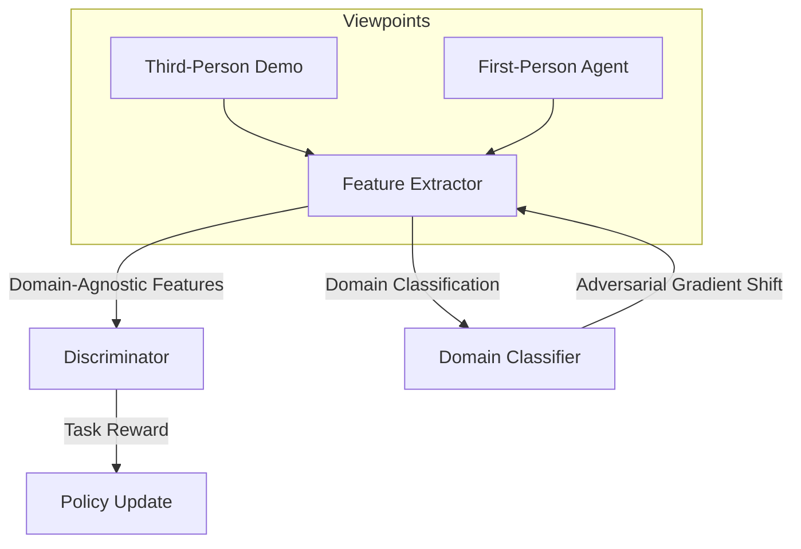

# Third-Person GAIL: Third-Person Imitation Learning

Standard GAIL assumes that the expert and the learner share the exact same perspective (e.g. first-person camera or identical environment coordinates). In many settings, we only have access to demonstrations filmed from a third-person perspective (e.g., watching a human complete a task). **Third-Person GAIL** introduces domain-confusion to bridge this viewpoint mismatch.

---

## 1. The Core Problem
* **Viewpoint Mismatch:** A robot looking through its own camera (first-person) sees something completely different than a static camera recording a human expert (third-person).
* **Feature Covariate Shift:** Standard GAIL discriminators will quickly learn to distinguish the agent from the expert based on visual domain features (background, perspective, camera angle) rather than the actual task dynamics, rendering the reward signal useless.

---

## 2. Third-Person GAIL Mechanism
Third-Person GAIL leverages adversarial domain adaptation:
1. **Feature Extractor ($F$):** A neural network that processes observations from both viewpoints and maps them to a latent space.
2. **Domain Classifier ($D_{domain}$):** Trained to predict which perspective (first-person agent or third-person expert) the latent features came from.
3. **Adversarial Training (Gradient Reversal):** The feature extractor is trained to *maximize* the domain classifier's loss, forcing the latent representations to become viewpoint-invariant.
4. **Task Discriminator ($D_{task}$):** Evaluates whether the viewpoint-invariant features represent expert-like behaviors, providing the reward signal to the agent.

---

## 3. Architecture Diagram

---

## 4. Key Advantages
* **Learn from Video:** Allows robots to learn tasks directly from third-person video demonstrations (e.g., YouTube videos of humans).
* **Viewpoint Generalization:** Extracted policies can adapt to novel camera locations.
* **Domain-Agnostic Representation:** Encourages the model to focus on the semantic "intent" of actions rather than visual details.

---

## 5. Paper Reference
* **Paper Title:** *Third-Person Imitation Learning*
* **Publication:** ICLR 2017
* **Paper Link:** [arXiv:1703.01703](https://arxiv.org/abs/1703.01703)

---

[← Back to README](../README.md)
